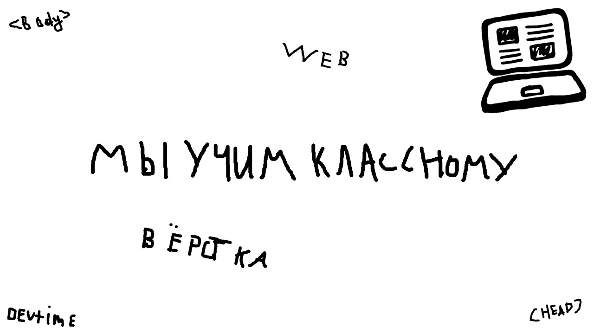

# Экзаменационный проект Git

```
git clone https://github.com/SERPOVSKOY/exam-git.git
```

| ` Технологии ` |
|:----------:|
| Sass     |
| Pug      |
| BEM      |


Макет [figma](https://www.figma.com/file/zpvIvtNLH1RB5kf7WJqdiN/Material-Design-Desktop-Kit-for-Figma-(Free-Edition)-(Copy)?node-id=1856%3A32)

Автор: Михаил Барбашев (12 лет)


